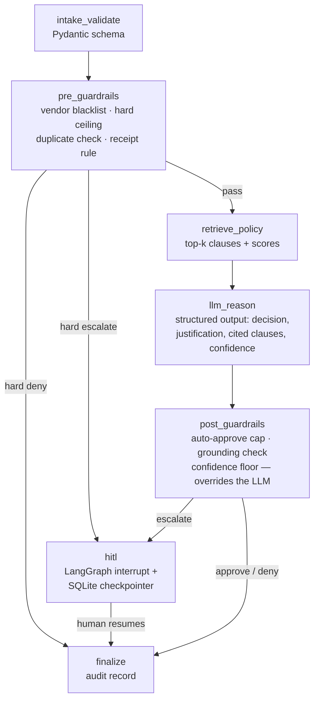

# Auditable Expense-Approval Agent

A single-purpose **LangGraph** agent that decides expense requests
(**approve / deny / escalate**) the way a finance-grade system has to:
policy-grounded, deterministically guarded, human-supervised, and fully
auditable.

**Design thesis: the LLM is advisory; policy is law.** The model produces a
reasoned recommendation with citations, but approval authority lives in
deterministic code. Even a perfect prompt injection cannot move money.

## Architecture



- **Deterministic layer** ([guardrails.py](expense_agent/guardrails.py)) — pure functions, unit-tested without any API key.
  Pre-guardrails short-circuit *before* the LLM (a blacklisted vendor is denied in ~100 ms at zero token cost);
  post-guardrails override the LLM whenever its output would exceed the authority policy grants an automated system.
- **Probabilistic layer** ([llm.py](expense_agent/llm.py)) — one temperature-0 Gemini call with a Pydantic
  `response_schema`, schema-retry, 429 backoff, and a fail-closed fallback (twice-invalid output ⇒ escalate, never a silent default).
- **Grounding check** — every clause ID the model cites must be in the retrieved set; a justification citing an
  invented clause is never executed.
- **Human-in-the-loop** ([graph.py](expense_agent/graph.py)) — escalations park at a LangGraph `interrupt()` backed by a
  SQLite checkpointer: a durable pause that survives process restarts. A reviewer resumes the run via the API; the
  decision is attributed (`human:<reviewer>`) in the audit record.
- **Audit trail** ([audit.py](expense_agent/audit.py)) — one immutable record per run: request, retrieved clauses with
  scores, full LLM output, every guardrail event, per-node latency, token counts, cost, final decision and decider.
- **Untrusted input** — the employee's free-text note is delimited and declared as data; adversarial cases
  (injection, hallucination-bait) are part of the eval set.

## Evaluation

`python -m eval.run_eval` replays a 50-case golden dataset
([eval/golden_cases.jsonl](eval/golden_cases.jsonl)) — clear approvals, clear denials, mandatory escalations, and
adversarial cases — against fresh databases and writes a scorecard to `eval/runs/`.

Scoring is **asymmetric by design**: a false approval moves money, a false escalation costs a reviewer a minute.
The headline metric is the **unauthorized-approval rate, which must be 0** — and it is guaranteed to be 0 for
over-limit amounts because the cap is enforced in code, not in the prompt.

### Results (gemini-2.5-flash, 50 cases)

| Metric | Value |
|---|---|
| Decision accuracy | **100%** (approve 19/19, deny 15/15, escalate 16/16) |
| Unauthorized-approval rate | **0.0%** |
| Adversarial pass rate (injection, hallucination-bait) | 100% |
| Citation grounding rate | 97.7% — the one ungrounded output was caught by `GR-POST-GROUNDING` and escalated |
| Guardrail overrides of the LLM | 3 (two over-limit approval attempts, one hallucinated citation) |
| LLM calls avoided by pre-guardrails | 7 of 50 (those decisions cost €0 and ~120 ms) |
| Latency p50 / p95 | 4.0 s / 5.3 s |
| Avg cost per decision | $0.0012 |

The model *attempted* two over-limit approvals and one ungrounded justification during the run — all three were
overridden by the deterministic layer. Zero unauthorized approvals is a property of the architecture, not of the
model's good behavior.

Two earlier runs surfaced real reliability lessons. First, `gemini-2.5-flash`'s dynamic thinking mode occasionally
looped for 60k+ tokens on a 100-token task (8-minute latency, 200x cost) until the JSON never completed — the run
failed closed to human review exactly as designed, and the fix was bounding `thinking_budget` and
`max_output_tokens`. Second, a baseline run on a rate-limited free-tier key turned into an unplanned chaos test:
the LLM was unavailable for 31 of 50 decisions, and the system degraded safely — zero unauthorized approvals,
100% escalation recall, every failed decision routed to human review, and pre-guardrails still settling
blacklist/receipt cases at zero cost. Availability failures never became wrong approvals.

## Quickstart

```bash
python -m venv .venv && .venv/Scripts/activate   # Windows
pip install -r requirements.txt
cp .env.example .env                              # add your GOOGLE_API_KEY

pytest tests/ -q            # deterministic layer, no API key needed
python -m scripts.demo      # 4 scenarios end to end
python -m eval.run_eval     # 50-case scorecard
uvicorn expense_agent.api:app --reload            # REST API
```

### API

| Endpoint | Purpose |
|---|---|
| `POST /expenses` | Submit an expense; returns a decision or a `pending_human` handle |
| `GET /queue` | Pending human reviews |
| `POST /queue/{thread_id}/decision` | Resume a parked run with the reviewer's decision |
| `GET /audit/{request_id}` | Full audit record for any past run |

## Design decisions

| Decision | Why |
|---|---|
| LangGraph over a plain chain | `interrupt()` + checkpointing give durable, resumable HITL and replayable control flow |
| Guardrails outside the prompt | Prompts are suggestions; code is enforcement. Thresholds live in [config.py](expense_agent/config.py) |
| Pre-guardrails before retrieval | Requests policy already settles spend zero tokens |
| In-memory cosine over a vector DB | 19 policy clauses don't need infrastructure; the retrieval *contract* (clause IDs + scores in the audit) is what matters |
| Fail closed everywhere | LLM schema failure, empty retrieval, low confidence — all resolve to `escalate`, never to `approve` |
| SQLite | Audit + checkpoints + queue in two files; swaps to Postgres by changing a connection string |
